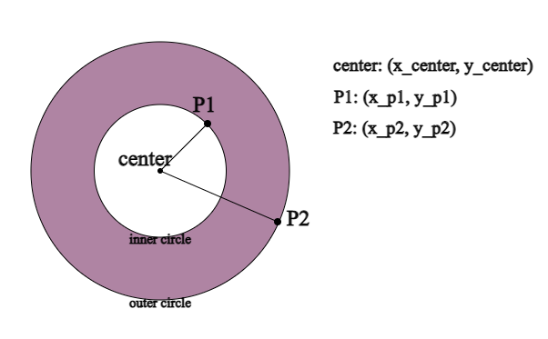
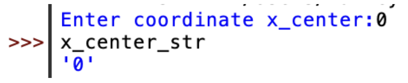
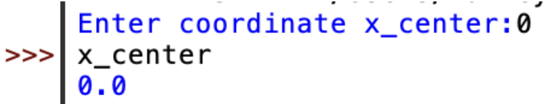
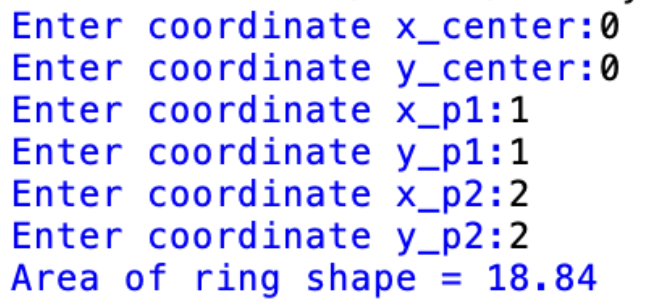
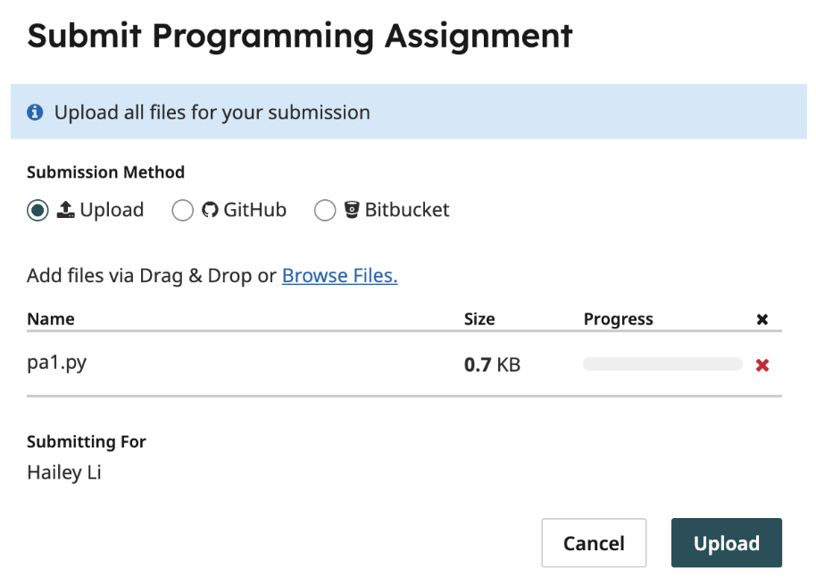
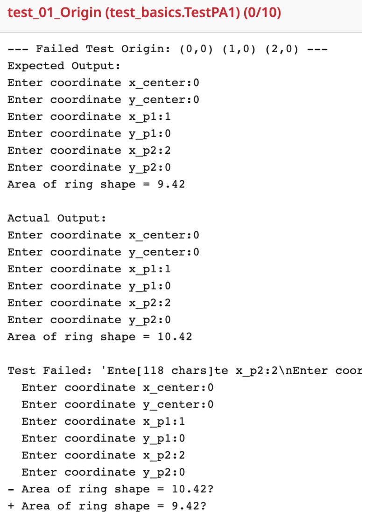
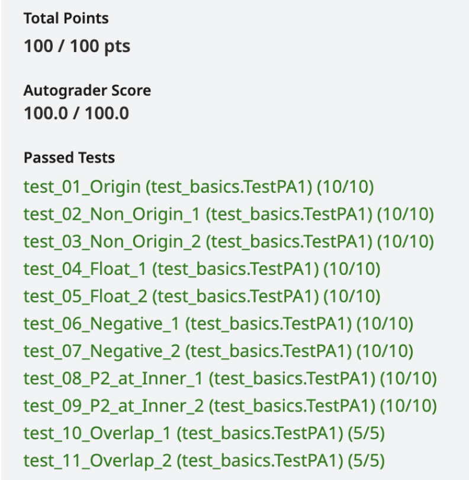

# CSE 8A Winter 2026 PA1

**Due Date: Sunday, January 15, 2025, 11:59 PM PST**

## Provided Files
None

## File(s) to Submit
`pa1.py` (details on how to submit your file can be found below)

---

## Part 1. Implementation (100 points)

In this programming assignment, you will be asking the user for the coordinates of three points (the center point, followed by two points, each from the circumference of two concentric circles) to calculate the area of a ring shape and print the result.

Please create a new file called `pa1.py`. You are going to work on this file for the coding part of this assignment. The file name must match to pass the tests.

---

## Part 1.1 Task Description

Your task is to write a program that takes in numeric inputs from the user representing the coordinates of three points, and prints the area of a ring shape derived from these three points.

A ring shape is basically composed of two concentric circles (i.e. two circles with the same center point). In this program, the user will:

First input numbers `x_center` and `y_center` representing the `(x_center, y_center)` coordinates for the center point,

Then numbers `x_p1` and `y_p1` representing the `(x_p1, y_p1)` coordinates for P1, a point on one circle of the ring shape,

And lastly numbers `x_p2` and `y_p2` representing the `(x_p2, y_p2)` coordinates for P2, a point on the other circle of the ring shape.

Note that the first pair of input numbers is always the coordinates of the center, while the second and the third pairs of coordinates are input in an arbitrary order. In other words, we don't know which point between P1 and P2 gives you the inner circle, and which one gives you the outer circle.

The graph below shows you the case when P1 resides on the inner circle and P2 resides on the outer circle. The purple area is the area of the ring shape:



As you can see, the area of the ring shape is basically the difference between the area of the inner circle and the area of the outer circle.

You will use the following formula to compute the **area of a circle**:

$$\text{area of circle} = 3.14 \times ((y - y_{\text{center}})^2 + (x - x_{\text{center}})^2)$$

where `x_center` and `y_center` are the xy-coordinates of the circle’s center point, and `x` and `y` are the coordinates of a point on the circle’s circumference. For the simplicity of testing, please use `3.14` as the value of pi, or your code might be marked incorrect.

Just for your curiosity, the steps below show you how the formula above was derived. **We are not asking you to implement these steps. You can use the formula above directly.**

$$\text{area of circle} = 3.14 \times \text{radius}^2$$

The radius is the [Euclidean distance](https://en.wikipedia.org/wiki/Euclidean_distance) between the center point and a point on the circle’s circumference.

$$\text{radius} = \sqrt{(y - y_{\text{center}})^2 + (x - x_{\text{center}})^2}$$

---

Now we can plug the radius into the area formula.

$$\text{area of circle} = 3.14 \times \left(\sqrt{(y - y_{\text{center}})^2 + (x - x_{\text{center}})^2}\right)^2$$

The square root and square cancel which gives the formula.

$$\text{area of circle} = 3.14 \times ((y - y_{\text{center}})^2 + (x - x_{\text{center}})^2)$$

After calculating the area of these two concentric circles, the area of the ring shape is the difference between them.

$$\text{area of ring shape} = \text{area of outer circle} - \text{area of inner circle}$$

The following steps show you some implementation details, and how you can run and test your program.

---

## Part 1.2 Implementation Details & How to Run/Test Your Program

1. Your program should prompt the user with the messages:

```
"Enter coordinate x_center:"
"Enter coordinate y_center:"
"Enter coordinate x_p1:"
"Enter coordinate y_p1:"
"Enter coordinate x_p2:"
"Enter coordinate y_p2:"
```

   Your messages have to match the strings above. In `pa1.py`, define variables called `x_center_str`, `y_center_str`, `x_p1_str`, `y_p1_str`, `x_p2_str`, `y_p2_str` that each contain a string received as input from the user (hint: use the `input()` function). You can start with only the first message: `"Enter coordinate x_center:"` and store the input in the variable `x_center_str`.

2. Run the module in IDLE Shell.

   The screenshot below shows what it should look like if everything is working (with taking in only the first coordinate `x_center_str`). Note two things: My program printed `"Enter coordinate x_center:"`, then I typed in the `0` and pressed Enter. Then, at the Python prompt, I typed in the name of the `x_center_str` variable to check that it had the value I expected (in this case, the string `"0"`).

   

3. If your program doesn't have the behavior described above, re-check your program to see if you might have made a mistake – did Python give you an error message? Did you make a typo in the name of a variable or command?

4. Once the above interaction works, add another variable definition to your program after `x_center_str` called `x_center`. You should make it so your program stores the numeric value in `x_center` represented by the string `x_center_str`. Hint: use the `float()` function! Repeat this for all of the strings (`x_center_str`, `y_center_str`, `x_p1_str`, `y_p1_str`, `x_p2_str`, `y_p2_str`).

5. Check that your program works before moving on – run the command:

```bash
python -i pa1.py
```

   Give inputs, check that the variables have the values you expect. Below is an example for taking only input for the first coordinate.

   

6. Once that part works, define two other variables called `area_circle1` and `area_circle2` that contains the area of each circle computed from the input coordinates to the center. Run the program and check again that it works as expected.

7. Calculate the area of the ring shape (area of bigger circle - area of smaller circle). Since the second and third coordinates can come in any arbitrary order, we don’t know which circle is larger (hint: use the `abs()` function). Since the calculation involves square of float numbers, you'll need to round your final answer to two decimal places (hint: use the `round()` function. Check out the [documentation](https://docs.python.org/3/library/functions.html#round) to see how we can use it here.)

8. Finally, add a `print` statement at the end of your program that displays the value of the area of the ring after the message. A run of your program should now look like this (note the lack of `-i`!). Now your program should ask you for input coordinates and it should produce an output area like below. Feel free to test your program with various inputs (different coordinate values).

   
---

## Submission

Once you are confident that your program is correct, you may submit it to Gradescope. Please double-check that the file name is `pa1.py`. The file name has to match this exactly to pass the autograder.



If you got any test cases wrong, you may have feedback that looks like this:



It could mean that your program isn’t doing the right calculation, or some of the texts are not matching exactly. Double check: Are you using the correct formula? Do you have all the spaces in place?

But don’t worry too much as you can submit multiple times! You may continue submitting until your program passes all test cases.

For this PA, we have 11 test cases in total. When you pass all the test cases, you should be able to see this:


